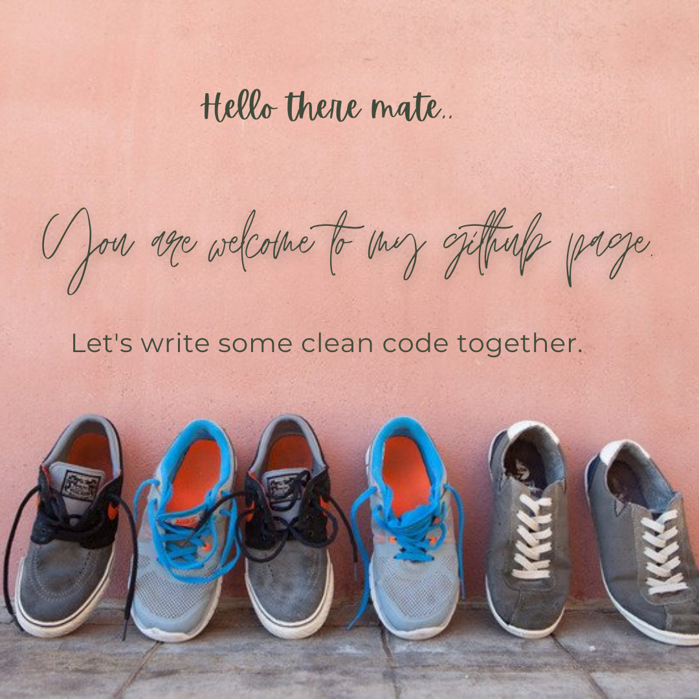

<h1 align="center">Hello there!  I am Ashesh </h1>
<!--
**hash-slash/hash-slash** is a ✨ _special_ ✨ repository because its `README.md` (this file) appears on your GitHub profile.-->

<h2 style="margin-left:10%">Interested in: </h2>

Here are some ideas to get you started:

- 🔭 I’m currently working on :
   -> making an animated webpage from scratch
   -> making a clone of youtube
- 🌱 I’m currently learning :
   ->HTML
   ->CSS
   ->Python
   ->MATLAB
   ->Javascript
   ->Django
- 👯 I’m looking to collaborate on :
   ->Anything that brings with it some learning
- 🤔 I’m looking for help with ...
   ->Django
- 💬 Ask me about:
   ->Competitive Programming
   ->Machine Learning
- 📫 How to reach me:
   ->Discord: Soul_Inferno#0280
   ->Gmail: ashsaha123@gmail.com
   ->Instagram: ashesh_saha
- 😄 Pronouns: 
   ->He/Him
- ⚡ Fun fact: 
   -> I suck at interviews.
   -> I won IOEL 
   -> I am vegeterian😉
   
   ## 📈 GitHub Stats 

### Trophy:
 

    

 

made with ❤ by Ashesh
